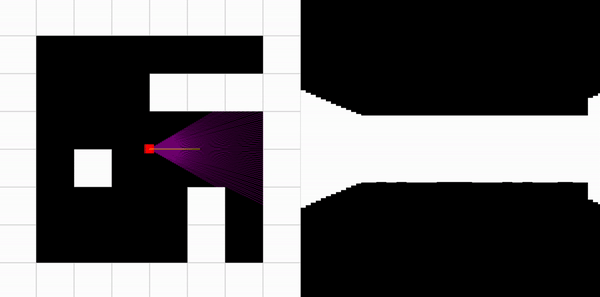

# Raycasting Engine

<div align="center">
  
  <p align="center"><br>
<i>Demo of Raycasting Engine</i></p>
</div>
<br>

Raycasting is a technique used in computer graphics to render a 3D scene efficiently using trigonometry and a 2D projection. In this particular implementation, I used the Pygame library to develop a raycasting engine that displays a 2D map to demonstrate the data used for calculations, alongside a 3D representation. This has been a great project for practicing manipulating data with vector operations, trigonometric functions, and visualizing it using Pygame.

## How it works.

The code involves several mathematical calculations to achieve the raycasting effect. Here's an explanation of the key math concepts and calculations used:

The code utilizes the `pygame.math.Vector2` class to perform vector operations and to represent 2D vectors. Vectors are used to store the player's position, direction, and ray directions.

Trigonometric functions (such as `np.sin` and `np.cos`) are used to calculate the direction of the player and the rays. The player's direction is stored as a unit vector (`player_dir`) that represents the current angle of the player. The angle is converted to a unit vector using the `np.cos` and `np.sin` functions. 

Trigonometric functions also help reduce the fisheye effect. To correct the fisheye distortion caused by the perspective projection, the code applies a correction factor to the calculated distance. This is done by multiplying the distance by the cosine of the angle between the player's direction and the ray direction. This ensures that the walls appear straight and not curved. Below is what it would look like without the necessary trig calculations.

<div align="center">
  
  <p align="center"><br><i>With Fisheye</i></p>
</div>
<br>
<div align="center">
  
  <p align="center"><i><br>Without Fisheye</i></p>
</div>
<br>

Inside the raycasting loop, each ray is cast by calculating its direction vector. The direction is determined by taking the current angle of the player, as seen below.

```
angle = player_a - np.pi / 6 + (i / num_rays) * np.pi / 3
ray_dir = pygame.math.Vector2(np.cos(angle), np.sin(angle))
```

The code calculates the distance between the player's position and the first intersection of the ray with a wall. This is done by iterating over the grid cells and checking if the ray intersects with any walls. 


## Prerequisites

- Python 3.x
- Pygame library
- NumPy

## Usage

1. Clone or download the repository to your local machine.

2. Install Pygame and NumPy library using pip:
```
python3 -m pip install pygame numpy
```

3. Make any desired modifications. (Read *Customizations*)

4. Save the code in a Python file with a `.py` extension (e.g., `raycaster.py`).


5. To run the program, open a terminal or command prompt and navigate to the directory where the Python file is saved. Then execute the following command:

```
python3 raycaster.py
```

6. Once the program starts, you can control the player's movement using the following keys:

    - **A**: Move the player to the left.
    - **D**: Move the player to the right.
    - **W**: Move the player forward.
    - **S**: Move the player backward.

The program will cast rays from the player's position to create a 3D-like visualization. You can observe the rays and the walls in the 2D and 3D surfaces of the window.

To quit the program, press the X at the top left to close the window.

## Customization

You can modify certain parameters in the code to customize the behavior and appearance of the raycaster:

- **Obstacles**: The layout of the blocks in the map can be customized by modifying the `obstacles` list. The number 1 represents a wall, and 0 represents an empty space. 

- **World Size**: The dimensions of the game window can be adjusted by changing the `worldx` and `worldy` variables. By default, the window size is set to 600x600 pixels.

- **Grid Size**: The number of cells in the grid can be modified by changing the `grid_size` variable. This determines the size and number of walls in the map.

- **Player Properties**: The player's size and movement speed can be adjusted by modifying the `player_width`, `player_height`, and `player_speed` variables. These variables are defined relative to the size of each block you see on the screen.

- **Raycasting Parameters**: The number of rays and the field of view can be adjusted by changing the `num_rays` variable and modifying the `angle` calculation inside the raycasting loop. Warning: this could affect how the 3D projection renders.

Feel free to experiment with these parameters to create different maps and visualizations.


## Acknowledgements

This code is a simple implementation of the raycasting technique and is inspired by classic first-person shooter games like Wolfenstein 3D. The Pygame library is used for creating the game window and handling user input. I'd also like to acknowledge and shoutout 3D Sage's YouTube channel for helping me understand raycasting better.


## License

This code is released under the [MIT License](https://opensource.org/licenses/MIT). Feel free to modify and distribute it as needed.


## Future suggestions

Here are some ideas and suggestions for future additions to the project:

- Implement texture mapping
- Implement dynamic lighting effects and shading.
- Allow for barriers to be varying heights
- Rewrite this in a lower-level language. I've written this in Python with Pygame because my background is in data analytics, but I encourage you to try to rewrite this in a lower-level language, like Rust or C with Vulkan or OpenGL.
- Consider using techniques like frustum culling and parallel processing techniques so the program is less CPU-intenseive.
